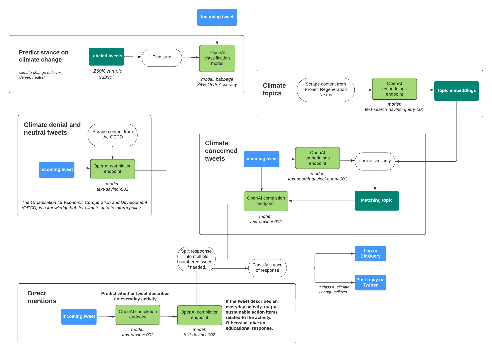

# The Climate AIdvocate

Serving code for the [@ClimateAIdvocat]. The climate AIdvocate is a GPT-3 powered
twitter bot that flags false or misleading tweets about climate change, and
responds with useful resources.

## Real-time Tweet Pipeline

1. Twitter to Pub/Sub

    An application deployed with the App Engine that monitors tweets in real-time
    and pushes them to a Pub/Sub topic. Every tweet that matches any of the
    `StreamRule`s will be picked up by the `PubSubStreamer`.

2. Pub/Sub to BigQuery

    Tweets published to the topic then trigger a Cloud Function that parses the
    tweet and adds them to BigQuery.

Based on:
- [Real-time data analysis using Kubernetes, PubSub, and BigQuery]
- [Real time tweets pipeline using GCP]
- [Streaming data from Twitter to GCP]
- [Copy data from Pub/Sub to BigQuery]

[@ClimateAIdvocat]: https://twitter.com/ClimateAIdvocat

[Real-time data analysis using Kubernetes, PubSub, and BigQuery]:https://github.com/GoogleCloudPlatform/kubernetes-bigquery-python/blob/master/pubsub/README.md

[Real time tweets pipeline using GCP]: https://github.com/polleyg/gcp-tweets-streaming-pipeline

[Streaming data from Twitter to GCP]: https://medium.com/syntio/streaming-data-from-twitter-to-gcp-7b92c84211a7

[Copy data from Pub/Sub to BigQuery]: https://medium.com/@milosevic81/copy-data-from-pub-sub-to-bigquery-496e003228a1

## Generate Random Climate Facts

The Climate AIdvocate regularly asks for GPT-3 to generate a fun fact about a
curated list of topics. This is also implemented via a Cloud Function with a
Cloud Trigger that runs on a fixed cadence and a RNG roll to prevent it from
posting at that fixed cadence.

This was a cost-effective way to let the bot tweet in a less predictable cadence
for the duration of the OpenAI Hackathon.

## Responding to Tweets

### Architecture for Response Generation
\

Climate AIdvocate is more careful when responding to tweets than when generating
fun facts.

To understand the audience, we fine-tuned GPT-3 on external data [2, 3] to
classify the stance of incoming tweets into `believer`, `neutral` and `denier`.
Climate AIdvocate uses this model to identify the author's persona and respond
appropriately.

### Climate Change Believers
When addressing believers, it uses a database of curated topics from
[Regeneration's Nexus] to seed the prompt and reply in a way that encourages
believers from taking action. It uses the `text-similarity-davinci-001` model to
generate embeddings for the incoming tweet and cosine similarity to find the
topic in our database that is the closest to the topic in the tweet.

### Climate Change Deniers
For tweets with neutral or denier stances, Climate AIdvocate gives a generic response
which replies to potentially misleading content with factual information. We found
that pulling from a set of data sources is crucial here to reduce the risk of the
occasional climate denial response.

### Safety Checks
Before the bot tweets a response, we apply the same stance classifier used on
incoming tweets to our response. If the response is not classified as climate
change `believer`, it flags the tweet as potentially unsafe
and does not send.

### Direct Mentions
If a user mentions [@ClimateAIdvocat]
and describes an everyday activity in their tweet, the bot recommends related
action items that promote sustainability.
We use GPT-3 as an unsupervised classifier here to determine whether the
content of the tweet fits this criteria. Otherwise, we respond with factual
information using GPT-3.

### Logging
Every generated response, regardless of whether it was submitted or not, is
logged to another table in BigQuery. This is an important step that allows
humans to monitor the bot activity. It also generates additional training data
for the bot, which can then be use to improve the quality of its answers.

## References
1. [Regeneration Nexus, Project Regeneration.](https://regeneration.org/nexus)
2. [The climate change Twitter dataset (Effrosynidis et al., 2022)](https://doi.org/10.1016/j.eswa.2022.117541)).
3. [Exploring climate change on Twitter using seven aspects: Stance, sentiment, aggressiveness, temperature, gender, topics, and disasters (Effrosynidis et al., 2022)](https://doi.org/10.1371/journal.pone.0274213)).
